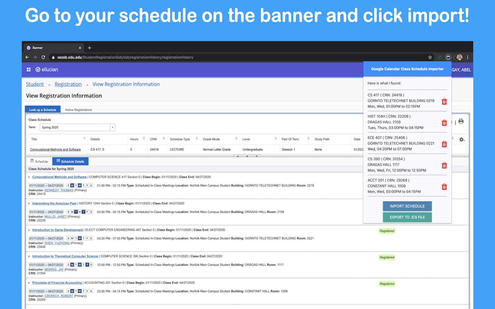
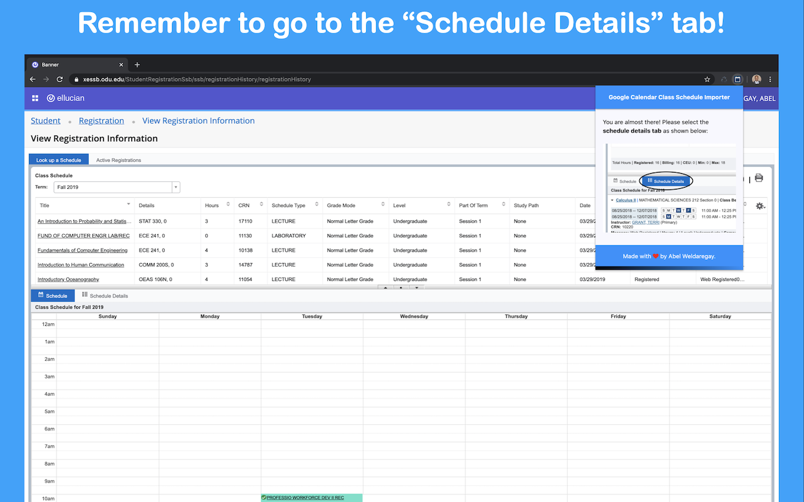

# Banner GCal Schedule Importer

Tired of manually creating a new calendar for your courses every single semester? Look no further! This chrome extension will pull the data from your banner (after you navigate to the schedule details page) and create a google calendar for you, filled with your semester's schedule! You can also remove courses you do not want to import/export in the preview page!

You can also export your class schedule as an .ics file and import it to google calendar, Microsoft outlook calendar, or any calendar of your choice! This works for all schools that use the banner and works for spring, fall, and summer courses!

## Demo Video
[

## After navigating to the scehdule details page, open the extension and click import!

  

## The final result will be a new google calander with all your courses!

  

## Make sure to switch to the schedule details tab!

  

If you find any bugs, please contact <b>abelweldaregay@gmail.com</b>.

# Links
- [Project Website](https://abelweldaregay.github.io/Banner-GCal-Schedule-Importer/)
- [Privacy Policy](https://abelweldaregay.github.io/Banner-GCal-Schedule-Importer/privacy.html)
- [Help Page](https://abelweldaregay.github.io/Banner-GCal-Schedule-Importer/help)

