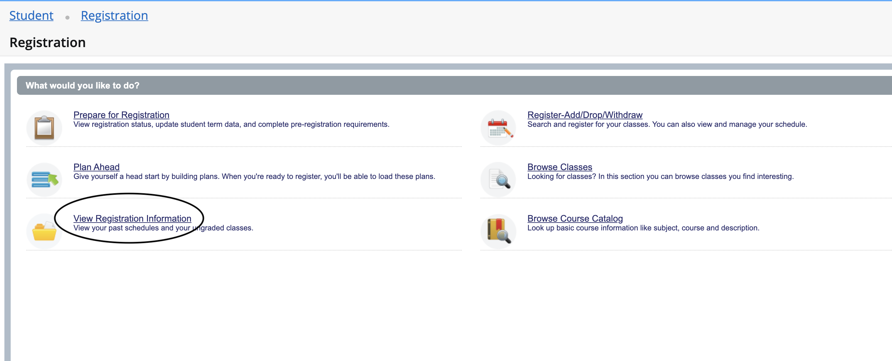
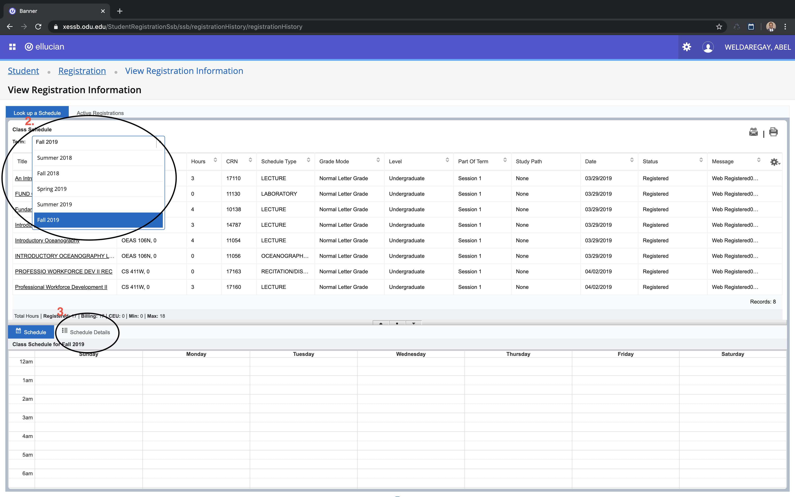
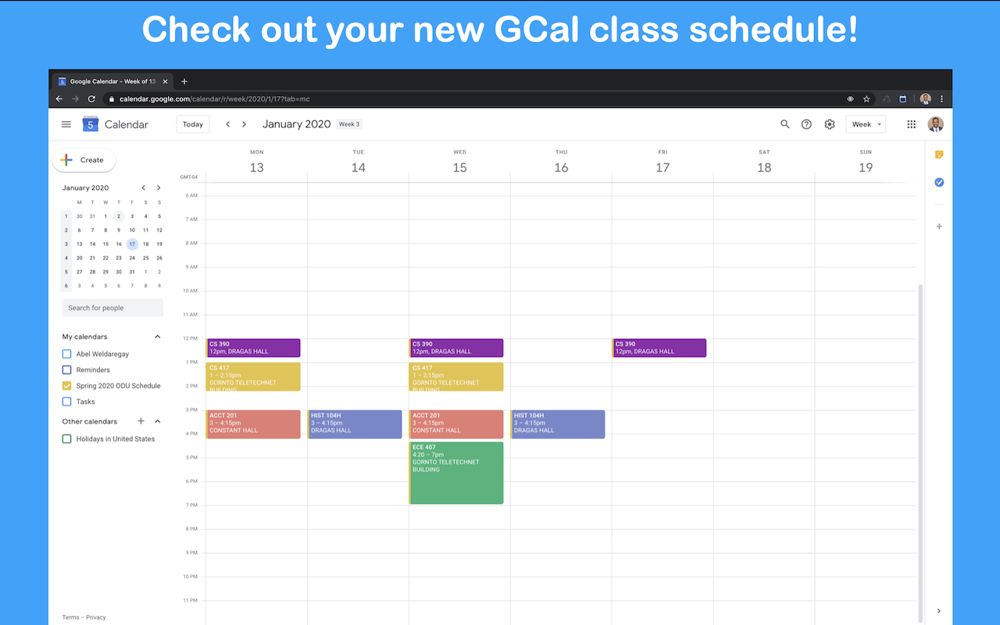

# How to Use the Banner-GCal-Schedule-Importer

## Importing
1. Navigate to the banner for your school
- If you are an ODU student, simply click "TAKE ME TO THE BANNER!" button and it will take you to the ODU banner
- If you are not from ODU, naviage to the banner for your school
2. Open the schedule details page and select a semester you want to import
    1. View Registration Information
      
    2. Select a semester you want to import 
    3. Select the schedule details tab
      
3. Open the extension and click "import schedule" and check out your new google calander filled with your classes for the semester!

## Exporting
// TODO

## Deleting Courses
// TODO

## FAQ
// TODO
