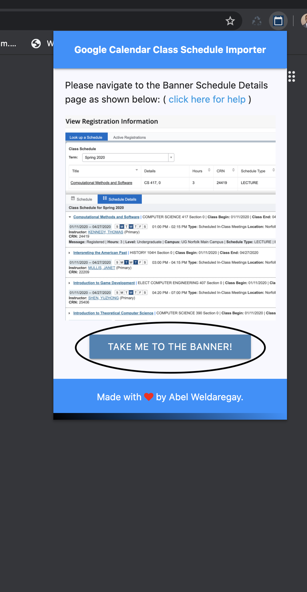

# How to Use the Banner-GCal-Schedule-Importer

## Importing Demo

## Importing
<b>1. Navigate to the banner for your school</b>
- If you are an ODU student, simply click "TAKE ME TO THE BANNER!" button and it will take you to the ODU banner
     
- If you are not from ODU, naviage to the banner for your school 

<b>2. Open the schedule details page and select a semester you want to import</b> 
        
  1. View Registration Information
    
  2. Select a semester you want to import (2) and switch to the schedule details tab(3)
    

<b>3. Open the extension and click "import schedule" and check out your new google calander filled with your classes for the semester!</b>
    

## Exporting to .ICS File

In order to export your schedule as an .ICS file, navigate to the banner (for your school) the same way you would for importing (shown above), and return to the extension. Once you open the extension again, press "EXPORT TO .ICS FILE".

Once it finishes downloading, upload it to Google calendar or Microsoft Outlook Calendar yourself!

Make sure to create a new empty calendar to upload to if you prefer your course schedule in its own separate calendar.
